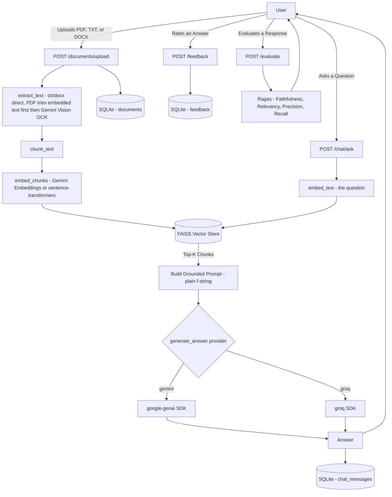

# ContextFlow AI

    

> Turn a folder full of documents into a system you can actually talk to — with real retrieval, real sources, and no guessing.

ContextFlow AI is a Retrieval-Augmented Generation (RAG) backend. You upload documents, it reads and indexes them, and then you can ask plain-English questions and get answers grounded in *your* documents, generated by either Gemini or Groq.

> **Status as of v0.2:** The core pipeline is built and working end to end using direct SDKs — no LangChain in the main pipeline. Gemini has a confirmed real answer in chat history. Groq is fully coded and wired but a live response has not been confirmed yet. See [Verification Status](#verification-status) for the honest breakdown of what's proven versus what's just written.

---

## Table of Contents

- [Overview](#overview)
- [What Is ContextFlow AI](#what-is-contextflow-ai)
- [The Problem It Solves](#the-problem-it-solves)
- [Understanding RAG](#understanding-rag)
- [Design Principles](#design-principles)
- [Architecture](#architecture)
- [Tech Stack](#tech-stack)
- [Project Structure](#project-structure)
- [Prerequisites](#prerequisites)
- [Getting Started](#getting-started)
- [Environment Variables](#environment-variables)
- [Running the Application](#running-the-application)
- [How It Works](#how-it-works)
- [Verification Status](#verification-status)
- [API Reference](#api-reference)
- [Known Simplifications](#known-simplifications)
- [Evaluation and Optimization](#evaluation-and-optimization)
- [Roadmap](#roadmap)
- [Documentation](#documentation)
- [Learning Path for Beginners](#learning-path-for-beginners)
- [Glossary](#glossary)
- [Contributing](#contributing)
- [License](#license)
- [Author](#author)

---

## Overview

- **Project type:** AI backend platform — API-first, no frontend
- **Core idea:** Retrieval-Augmented Generation over your own documents
- **Primary language:** Python
- **Framework:** FastAPI
- **LLM providers:** Gemini (confirmed working) and Groq (coded, not yet live-confirmed)
- **Current version:** 0.2.0
- **Current status:** Core pipeline built and functional; test suite exists; Ragas evaluation scaffolded

ContextFlow AI isn't "a chatbot that reads a PDF." It has a real API, a real database, two swappable AI providers behind one interface, and a folder structure that separates HTTP handling from business logic. Every service calls provider SDKs directly — no LangChain abstraction layer in the main pipeline.

## What Is ContextFlow AI

Imagine you have 50 PDFs — company policies, contracts, research papers. Normally you'd open each file and search manually, or use Ctrl+F and hope the wording matches exactly.

ContextFlow AI lets you do this instead:

1. Upload the PDFs once.
2. Ask, in plain English: *"What's our refund policy for enterprise customers?"*
3. Get an answer pulled from the real document, with the source noted — not made up.

Supported file types: `.txt`, `.pdf`, `.docx`

## The Problem It Solves

Organizations, and individuals, accumulate documents faster than anyone can read them. Regular keyword search fails because it matches words, not meaning, can't hold a conversation, and doesn't explain or summarize.

Large Language Models are good at understanding and explaining things, but they've never seen your private documents, and will confidently guess if you ask anyway. **Retrieval-Augmented Generation (RAG)** fixes this: give the model the right paragraphs *before* asking it to answer.

## Understanding RAG

```
Your question → find the most relevant chunks of your documents →
hand those chunks + your question to an LLM →
LLM writes an answer using ONLY that material → grounded answer
```

Think of it like an **open-book exam**. An LLM without RAG answers from memory alone — it might misremember or invent something. An LLM with RAG gets to open the book to the exact right page first.

Two things happen inside ContextFlow AI:

1. **Ingestion** (once, on upload): the document is split into chunks, each chunk becomes an embedding, stored in FAISS.
2. **Retrieval + Generation** (every question): the question is embedded too, compared against every stored chunk, and the most similar ones are handed to the LLM along with the question.

If a term is unfamiliar, check the [Glossary](#glossary).

## Design Principles

- **Direct SDKs over framework abstractions** — every service calls `google-genai` or `groq` directly, the same way you'd write a standalone script. No LangChain in the main pipeline.
- **Simplicity over unnecessary complexity** — no tool gets added just because it's trendy.
- **Modularity** — the RAG pipeline, the LLM provider, and the vector store are swappable pieces, not tangled together.
- **Configuration over hardcoding** — API keys, chunk size, top-k, storage paths, and log level all live in `.env`.
- **Provider independence** — switching from Gemini to Groq is a one-word change in the request body.
- **Readable code over clever code.**
- **Honesty about status** — a file existing and a file being *proven* are treated as two different facts in this README.

## Architecture



`llm_provider.py` is the only file that knows Gemini and Groq have different APIs — everything else calls one function, `generate_answer(prompt, provider)`.

## Tech Stack

| Technology | Category | Role |
|---|---|---|
| Python | Language | Runs the backend |
| FastAPI | Web framework | REST APIs, interactive docs |
| Uvicorn | Server | Runs the FastAPI app |
| `google-genai` | SDK | Gemini chat, embeddings, and vision (OCR) — called directly |
| `groq` | SDK | Groq chat completions (`llama-3.3-70b-versatile`) — called directly |
| PyMuPDF (`fitz`) | PDF rendering | Extracts embedded text; renders pages as images for OCR |
| `python-docx` | DOCX | Extracts paragraphs and table cells from Word documents |
| FAISS | Vector store | Stores and searches chunk embeddings |
| NumPy | Numerical | Vector formatting for FAISS |
| SQLite | Database | Documents, chat history, feedback |
| SQLAlchemy | ORM | Python-friendly SQLite access |
| Pydantic | Validation | Request and response schemas |
| python-dotenv | Config | Loads `.env` |
| python-multipart | — | Required by FastAPI for file uploads |
| sentence-transformers | Embeddings | Local embedding fallback (no API key required) |
| Ragas | Evaluation | 4-metric RAG evaluation pipeline (built and wired) |
| pytest | Testing | Test suite exists in `tests/` |
| Docker | Deployment | `Dockerfile` and `docker-compose.yml` exist |

**Note on LangChain:** LangChain is NOT used in the main pipeline. It appears only in `app/evaluation/evaluate_rag.py` because Ragas (the evaluation library) requires LangChain-compatible judge objects internally — this is a hard library constraint, not a design choice.

## Project Structure

```
contextflow-ai/
├── README.md
├── requirements.txt
├── Dockerfile
├── docker-compose.yml
├── .env                        # your real keys — never committed
├── .env.example                # template, safe to commit
├── .gitignore
│
├── docs/
│   └── PROJECT_BLUEPRINT.md    # Chapter 1 written; Chapters 2–30 planned
│
├── data/
│   ├── uploads/
│   └── vector_index/
│       ├── index.faiss
│       └── metadata.pkl
│
├── scripts/
│   ├── reset_db.py
│   └── run_evaluation.py
│
├── tests/
│   ├── conftest.py
│   ├── test_chat.py
│   ├── test_documents.py
│   ├── test_evaluate.py
│   ├── test_feedback.py
│   └── test_services.py
│
└── app/
    ├── __init__.py
    ├── main.py
    │
    ├── core/
    │   ├── config.py            # All settings read from .env
    │   └── logging_config.py
    │
    ├── db/
    │   └── database.py
    │
    ├── models/
    │   └── db_models.py         # Document, ChatMessage, Feedback
    │
    ├── schemas/
    │   ├── chat_schema.py
    │   └── document_schema.py
    │
    ├── api/
    │   └── v1/
    │       ├── documents.py     # POST /upload, GET /, DELETE /{id}
    │       ├── chat.py          # POST /ask
    │       ├── history.py       # GET /history/{session_id}
    │       ├── feedback.py      # POST /feedback
    │       └── evaluate.py      # POST /evaluate
    │
    ├── services/
    │   ├── chunker.py
    │   ├── document_processor.py
    │   ├── embeddings.py
    │   ├── vector_store.py
    │   ├── llm_provider.py
    │   └── rag_pipeline.py
    │
    └── evaluation/
        └── evaluate_rag.py      # Ragas 4-metric evaluation
```

## Prerequisites

- **Python 3.10 or newer**
- **A Gemini API key** — used for chat, embeddings, and OCR. Get one free at [ai.google.dev](https://ai.google.dev)
- **A Groq API key** — get one free at [console.groq.com](https://console.groq.com)
- Basic comfort with a terminal

> **No API key?** Set `EMBEDDING_PROVIDER=sentence-transformers` in `.env` to use a free local embedding model. You will still need a key for LLM generation.

## Getting Started

### 1. Open the project folder
```cmd
cd contextflow-ai
```

### 2. Create and activate a virtual environment
```cmd
python -m venv venv
venv\Scripts\activate
```

### 3. Install dependencies
```cmd
pip install -r requirements.txt
```

### 4. Set up your environment file
```cmd
copy .env.example .env
```
Open `.env` and paste in both API keys.

### 5. Run the server
```cmd
uvicorn app.main:app --reload
```
Tables are created automatically on first startup.

### 6. Open the interactive docs
`http://127.0.0.1:8000/docs`

## Environment Variables

| Variable | Default | Description |
|---|---|---|
| `GEMINI_API_KEY` | — | Gemini chat, embeddings, and vision/OCR |
| `GROQ_API_KEY` | — | Groq chat completions |
| `DEFAULT_LLM_PROVIDER` | `gemini` | Provider used when a request doesn't specify one |
| `EMBEDDING_PROVIDER` | `gemini` | `gemini` or `sentence-transformers` |
| `LOCAL_EMBEDDING_MODEL` | `sentence-transformers/all-MiniLM-L6-v2` | Model used when `EMBEDDING_PROVIDER=sentence-transformers` |
| `CHUNK_SIZE` | `500` | Characters per chunk |
| `CHUNK_OVERLAP` | `50` | Overlap between adjacent chunks |
| `TOP_K_RESULTS` | `4` | Number of chunks retrieved per question |
| `UPLOAD_FOLDER` | `data/uploads` | Where uploaded files are stored |
| `VECTOR_INDEX_PATH` | `data/vector_index/index.faiss` | FAISS index location |
| `DATABASE_URL` | `sqlite:///./app/db/contextflow.db` | SQLAlchemy connection string |
| `LOG_LEVEL` | `INFO` | `DEBUG`, `INFO`, `WARNING`, `ERROR`, or `CRITICAL` |

## Running the Application

```cmd
uvicorn app.main:app --reload
```

API at `http://127.0.0.1:8000` · Docs at `/docs` · Health check at `/health`

## How It Works

**1. Upload a document:**
```bash
curl -X POST "http://127.0.0.1:8000/api/v1/documents/upload" -F "file=@policy.txt"
```
```json
{"id": 1, "filename": "policy.txt", "chunks_created": 4, "status": "uploaded and indexed"}
```

**2. Ask a question:**
```bash
curl -X POST "http://127.0.0.1:8000/api/v1/chat/ask" \
  -H "Content-Type: application/json" \
  -d '{"question": "What is the leave policy?", "provider": "gemini"}'
```
```json
{
  "session_id": "b3f1...",
  "message_id": 1,
  "provider": "gemini",
  "answer": "Employees get 18 paid leave days per year.",
  "sources": ["policy.txt"],
  "latency_ms": 843
}
```

**3. Continue the conversation** by sending the same `session_id` back. Switch `"provider": "groq"` to try the other model.

**4. List all documents:**
```bash
curl "http://127.0.0.1:8000/api/v1/documents"
```

**5. Delete a document:**
```bash
curl -X DELETE "http://127.0.0.1:8000/api/v1/documents/1"
```

**6. Retrieve chat history:**
```bash
curl "http://127.0.0.1:8000/api/v1/chat/history/b3f1..."
```

**7. Rate an answer:**
```bash
curl -X POST "http://127.0.0.1:8000/api/v1/feedback" \
  -H "Content-Type: application/json" \
  -d '{"message_id": 1, "rating": "up"}'
```

**8. Evaluate a response with Ragas:**
```bash
curl -X POST "http://127.0.0.1:8000/api/v1/evaluate" \
  -H "Content-Type: application/json" \
  -d '{"question": "What is the leave policy?", "answer": "18 days.", "contexts": ["Employees get 18 days paid leave."]}'
```

## Verification Status

| Component | Status | Notes |
|---|---|---|
| Health check | ✅ Confirmed | |
| Config loading (all .env settings) | ✅ Confirmed | |
| Database + all 3 tables | ✅ Confirmed | Created and written to |
| `.txt` extraction | ✅ Confirmed | |
| `.docx` extraction | ✅ Coded | Not yet live-confirmed |
| `.pdf` extraction (embedded text) | ✅ Coded | Smart fallback path added |
| `.pdf` extraction (Gemini Vision OCR) | ⚠️ Not confirmed | Returned blank in early test — no real key set at the time |
| Chunking | ✅ Confirmed, narrowly | Only single-chunk case tested end-to-end |
| Embeddings (Gemini) | ⚠️ Inferred | Working because retrieval later returned real content |
| Embeddings (sentence-transformers) | ✅ Coded | Not tested end-to-end |
| FAISS store/search | ✅ Confirmed, narrowly | Tested with real embeddings through RAG |
| Upload pipeline — `.txt` | ✅ Confirmed | Real answer citing specific content proves it |
| Upload pipeline — `.pdf` / `.docx` | ⚠️ Not confirmed | |
| RAG answer via Gemini | ✅ Confirmed | Real question/answer in chat history |
| RAG answer via Groq | ⚠️ Not confirmed | Fully coded; no live response yet |
| List documents | ✅ Coded | Not confirmed with live data |
| Delete document | ✅ Coded | Not confirmed with live data |
| Chat history | ✅ Confirmed | |
| Feedback | ✅ Confirmed | Valid + error cases tested |
| Ragas evaluation endpoint | ✅ Coded | Not confirmed end-to-end |
| Tests passing | ⚠️ Unknown | Files exist; no CI run output |

## API Reference

| Method | Endpoint | Description |
|---|---|---|
| `GET` | `/health` | Confirms the server is running |
| `POST` | `/api/v1/documents/upload` | Upload `.txt`, `.pdf`, or `.docx` — extract, chunk, embed, index |
| `GET` | `/api/v1/documents` | List all uploaded documents |
| `DELETE` | `/api/v1/documents/{id}` | Remove a document and its vectors |
| `POST` | `/api/v1/chat/ask` | Ask a question; `provider` and `session_id` optional |
| `GET` | `/api/v1/chat/history/{session_id}` | Retrieve a past conversation |
| `POST` | `/api/v1/feedback` | Rate an answer (`up` or `down`) |
| `POST` | `/api/v1/evaluate` | Evaluate a response with 4 Ragas metrics |
| `GET` | `/docs` | Interactive Swagger documentation |

## Known Simplifications

1. **Every scanned PDF goes through Gemini Vision OCR per page.** The smart path (try embedded text first, OCR only when empty) is now coded — this is no longer a blanket issue, but OCR is still called per-page for scanned files, which costs one Gemini call per page.
2. **The vector store reloads the entire FAISS index from disk on every call.** Fine at this scale; a real optimization target later.
3. **No authentication, rate limiting yet.** Anyone reaching the server can use your API keys.

## Evaluation and Optimization

Built and wired. The `/api/v1/evaluate` endpoint runs four Ragas metrics:
- **Faithfulness** — is the answer grounded in the retrieved context?
- **Answer Relevancy** — does the answer actually address the question?
- **Context Precision** — are the retrieved chunks relevant?
- **Context Recall** — do the chunks contain enough info to answer?

Not yet confirmed with a live end-to-end run. Optimization (chunk size, `top_k`, prompt wording, Gemini vs Groq comparison) is planned once there's real evaluation data.

## Roadmap

| Phase | Focus | Status |
|---|---|---|
| 1 | FastAPI skeleton, SQLite models, health check | ✅ Done |
| 2 | Document upload, text extraction, chunking | ✅ Done |
| 3 | Embeddings and FAISS integration | ✅ Done |
| 4 | RAG question-answering, Gemini + Groq | ✅ Done (Gemini confirmed; Groq coded) |
| 5 | Chat history, sessions, feedback | ✅ Done |
| 5.5 | Error handling, list/delete documents, logging | ✅ Done |
| 6 | Remove LangChain from main pipeline — direct SDKs only | ✅ Done |
| 7 | Automated tests (pytest) | 🟡 Files written, not confirmed passing |
| 8 | Ragas evaluation pipeline | 🟡 Built, not confirmed end-to-end |
| 9 | Live-confirm Groq, .docx, .pdf OCR | Not started |
| 10 | Optimization: chunk size, top-k, model comparison, caching | Not started |
| 11 | Auth, rate limiting, Docker deployment | Not started |
| Future | Audio transcription, agent workflows, multi-tenancy | Not started |

## Documentation

- [x] Chapter 1 — Project Overview
- [ ] Chapter 2 — Vision and Product Requirements
- [ ] Chapters 3–30 — Not yet written

## Learning Path for Beginners

1. Python fundamentals — functions, classes, basic `async`/`await`.
2. What an API is — FastAPI's official tutorial.
3. What an LLM actually is.
4. RAG — re-read [Understanding RAG](#understanding-rag).
5. Embeddings and vector search, conceptually.
6. Basic SQL.
7. Then build — the [Roadmap](#roadmap) shows what's next.

## Glossary

| Term | Plain-Language Meaning |
|---|---|
| LLM | An AI trained on huge amounts of text that can understand and generate human-like responses |
| RAG | Giving an LLM the right information before asking it to answer |
| Embedding | A list of numbers representing the "meaning" of a piece of text |
| Vector store | A database built to store embeddings and find the most similar ones fast |
| Chunking | Splitting a long document into smaller, retrievable pieces |
| Prompt | The exact text sent to an LLM as its instructions |
| Token | A small piece of text an LLM processes; usage/cost is measured in tokens |
| Hallucination | When an LLM confidently states something false or invented |
| Groundedness | How well an answer is actually supported by retrieved source material |
| ORM | Python instead of raw SQL for talking to a database |
| Endpoint | One specific URL in an API that does one job |
| OCR | Reading text out of an image — used here for scanned PDFs via Gemini Vision |
| SDK | Software Development Kit — the official library a provider ships to call their API |

## Contributing

Solo build, used as a learning project and portfolio piece.

## License

Not yet chosen. MIT is a common default for personal/portfolio projects.

## Author

Built by **[Your Name]** as a hands-on AI engineering project.
Reach out: **[your.email@example.com]** · **[LinkedIn]** · **[GitHub]**

---

*This README reflects the actual, current, honestly-verified state of the code — including what hasn't been proven yet. Keep it that way.*
